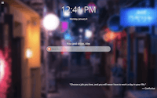

# SvelTab

A beautiful, customizable New Tab page for Firefox, Chrome, Edge and other Chromium-based browsers.

Transform your new tab page to something beautiful and yours. SvelTab offers hundreds of customization options to create a new tab page that unique to you. Choose from many background providers, and be rewarded with stunning, new pictures every time you open a new tab. Add your favorite widgets to stay productive throughout your day. Create your own new tab experience.

We care about your privacy and your experience. SvelTab is private, fast, and free.

## Key concepts and decisions

1. No ads, no trackers, no analytics, no data-mining or similar things
2. Preference to open-sourced privacy-oriented 3rd party services
3. Load time should be low, overall performance should be high
4. No polyfills to support obsolete browsers, targeting latest & greatest browsers only
5. [Firefox](https://www.mozilla.org/en-US/firefox/new/) as a primary browser for development and testing

## Screenshots

## Install

or [try web version first](https://bespoke-kitten-980bd0.netlify.app/)

## Translations

Checkout the guide for [adding translations](TRANSLATING.md).

## Want to say thank you?

* Buy me a coffee [here](https://ko-fi.com/akopachov) (No account needed, one-time)
* Become a patron at [Patreon](https://patreon.com/akopachov) (Account needed)
* [Z.Cash](https://z.cash/): `t1PCzJrd96RUfzjzhBERfXEFvSi7W6V86hM`
* [DOGE](https://dogecoin.com/): `DAa3nu1RCWwxZdAnGVga77bgxDFP1nhahj`
* [USDT](https://tether.to): `0xa12163eD56e35d3B38F7087B573384E40b2785e1`
* [TON](https://ton.org/): `UQCSBzoTb1B7RhXnka5RegmdjHR3gQwRVgZHNPPqzjjvlTKW`
