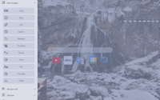

# SvelTab

A beautiful, customizable New Tab page for Firefox and Chrome.

We care about your privacy and your experience. SvelTab is private, fast, and free.

Key concepts and decisions behind SvelTab:

1. No ads, no trackers, no analytics, no data-mining or similar things
2. Preference to open-sourced privacy-oriented 3rd party services
3. Load time should be low, overall performance should be high
4. No polyfills to support obsolete browsers, targeting latest & greatest browsers only
5. [Firefox](https://www.mozilla.org/en-US/firefox/new/) as a primary browser for development and testing

## Screenshots

## Install

Links to other stores are comming soon...

## Want to say thank you?

* Buy me a coffee [here](https://ko-fi.com/akopachov) (No account needed, one-time)
* Become a patron at [Patreon](https://patreon.com/akopachov) (Account needed)
* [Z.Cash](https://z.cash/): `t1PCzJrd96RUfzjzhBERfXEFvSi7W6V86hM`
* [TON](https://ton.org/): `EQCSBzoTb1B7RhXnka5RegmdjHR3gQwRVgZHNPPqzjjvlW9T`
